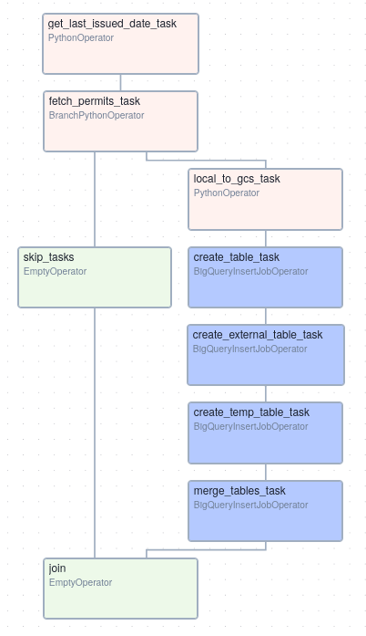
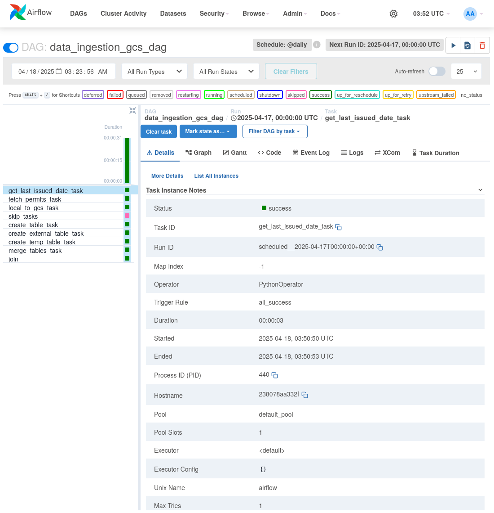

# Project Description for Evaluation

This section is to provide all documentation necessary for project evaluation. If evaluater wants to reproduce this project in its entirety, there is a section called "Instructions to Reproduce" later in this README, but it will take some time to set up, and you may accumulate charges with GCP.

## Problem

The NYC Department of Buildings publishes information daily about building permits issued citywide. The datasets containing these records are accessible via the NYC Open Data API powered by Socrata. The raw data is useful in its own right, but summary information about this data would be more useful to anyone interested in development around the city, such as real estate developers or urban development enthusiasts (this is me). This project was created to provide such a summary in a dashboard, including a list of the top neighborhoods in New York for construction of new buildings, and a map of the location of these projects, filtered by a date range. A data pipeline has been set up to ingest this data daily (batch workflow). The technologies used are as follows:

* **Dataset**: [NYC Open Data DOB Permit Issuance](https://data.cityofnewyork.us/Housing-Development/DOB-Permit-Issuance/ipu4-2q9a/about_data)
* **Cloud**: Google Cloud Platform
* **Infrastructure as Code**: Terraform
* **Workflow Orchestration**: Airflow
* **Data Lake**: Google Cloud Storage
* **Data Warehouse**: BigQuery
* **Batch Processing/Transformations**: Simple SQL transformations done within python DAG script (no dbt or Spark yet)
* **Dashboard**: Looker
* **Containerization**: Docker

## Full Workflow Description

A project was created with Google Cloud Platform for this effort. After that, Terraform was used to set up the Google Cloud infrastructure. Terraform creates two resources:

* A bucket in Google Cloud Storage (the data lake)
* A dataset in BigQuery (the data warehouse)

A docker compose file was written that sets up the Airflow configuration. Most of this code comes from directly from Airflow in a guide for use with GCP, but some modifications were made, including adding my specific GCP project info and mounting the credentials needed as volumes, as these credentials were placed in their own folders under my home directory (outside the project folder).

The heart of this project is the Python script "data_ingestion_gcs_dag.py" This sets up the DAG and its daily trigger. The first block in the DAG, **get_last_issued_date_task** looks at the final BigQuery table to find the last issuance date that appears. Building permits are posted as they are issued, so this task helps us ensure that new data can be pulled by querying data via the API with an issuance date on or after the latest date seen. If the table doesn't exist yet, the last issuance date is set to exactly five years ago from the run date.

The next task **fetch_permits_task** does the actually querying of the data we need from the API, but it first sets up the date range for which we need to query. It handles the API limit of 1000 records per API call, and the initial loading of the data, which contains a lot of records. It will pull all records from the last issuance date returned from the last task. The initial fetch takes some time (~10-15 minutes for me). Alternatively you could adjust the number of days in get_last_issued_date to less (currently set to 1825 days, or five years).

**local_to_gcs_task** uploads the raw data to the GCS data lake.

**create_table_task** handles the initial creation of the table we use for queries to the eventual dashboard. It partitions the table by issuance_date as that is the value we will use to custom filter in the dashboard. It is also clustered by gis_nta_name, job_type, borough, and block. gis_nta_name is the value we are using to sort the number of projects by neighborhood, and job_type is used as a filter to select only new builds. borough and block are not used at this point, but I plan to integrate them directly to change the map using a shapefile with borough, block, and lot subdivisions, so I can outline the lot where a project will take place rather than just place a simple dot on its location.

**create_external_table_task** sets up an external table from the raw data in the data lake that we can query in BigQuery, which is transformed into a new table in **create_temp_table_task**. The new table contains the columns borough, job_type, block, lot, issuance_date (converted to timestamp), permit_si_no (converted to int), location_coordinates (a concatenation of gis_latitude and gis_longitude that is used to plot the points), and gis_nta_name. This data is then merged with the final table in **merge_tables_task**, using permit_si_no to exclude permits already in the database.

**skip_tasks** handles cases where there is no data created as a result of **fetch_permits_task**, which will happen often (like on weekends and holidays). **join** completes the graph and gives the two branches in the DAG a logical endpoint.

The full DAG is illustrated below:



A successful run of new data being pushed through the process is shown below:



Finally, this data is displayed in the Looker dashboard:


The Looker dashboard is public and can be viewed here:

https://lookerstudio.google.com/reporting/65893063-076d-4e5e-8862-c85150799ac0

## Next Steps

The next step is to implement dbt to handle our current transformations and any others as the project scales.

This data can be joined with DOB NOW data using the permit_si_no. The NOW data would be useful as it has a job description column that gives a detailed description of each project. This would be useful for a pop up message when hovering on a locatiion in the map, rather than simply displaying the coordinates.

Another step is to map the developments using a shapefile to outline their lots, as was mentioned earlier.

Shapefiles that can be used for this are below (will trigger download, just leaving here for reference).

https://s-media.nyc.gov/agencies/dcp/assets/files/zip/data-tools/bytes/mappluto/nyc_mappluto_25v1_shp.zip

One last thing would be to run the entire project in the cloud so it doesn't need access to my local machine.

# Instructions to Reproduce

These instructions are a guide to replicate this project on your own machines/accounts, if desired, with some explanation of functionality. All instructions needed to run this project are located in this README, but if more help is needed, I will reference tutorials along the way that will provide additional information. These instructions are for a Linux-based operating system only.

Navigate to the directory where you want to run this project and clone with the following command:

git clone https://github.com/josh-monto/dob-permits.git

First we need to set up Terraform. For additional information on running Terraform with GCP beyond what is provided here, reference the following tutorial: https://developer.hashicorp.com/terraform/tutorials/gcp-get-started

To begin with Terraform and GCP, first a GCP account needs to be created if you don’t currently have one: https://cloud.google.com/

Once you have a GCP account, install Terraform from https://developer.hashicorp.com/terraform/install.

```bash
wget -O - https://apt.releases.hashicorp.com/gpg | sudo gpg --dearmor -o /usr/share/keyrings/hashicorp-archive-keyring.gpg
echo "deb [arch=$(dpkg --print-architecture) signed-by=/usr/share/keyrings/hashicorp-archive-keyring.gpg] https://apt.releases.hashicorp.com $(lsb_release -cs) main" | sudo tee /etc/apt/sources.list.d/hashicorp.list
sudo apt update && sudo apt install terraform
```

Next, install the Google Cloud command line interface from a bash terminal using one of the two following commands (you may need to add --classic):

sudo snap install google-cloud-cli

or

sudo snap install google-cloud-sdk

Log in to GCP in your browser, go to the console, and create a GCP project (This is where charges may start accumulating. Also no organization for location is fine). Select the new project near the top of the page. Take not of the project ID. You'll need it later. Navigate to "IAM & Admin," either from quick access or the sidebar menu. Then, in the sidebar, select "Service Accounts." On the Service accounts page click "+ Create service account." Give it a name and ID and click "Create and continue." In the second step, select the “Storage Admin” and “BigQuery Admin” roles. With those applied, now click "Done."

The sservice account will appear on the new page. Click the three dots at the right of the line it's listed on, under Actions, and select "Manage keys." On the Keys page, select Add key->Create new key. Select the JSON format and click Create. The JSON will download. Store this file to a private folder accessible by only you.

Now open you project directory in a code editor (like vscode). Within the “terraform” directory of the project (dob-permits/terraform), create a new file called “terraform.tfvars”. Place the the following content in the folder (you will need to pick a bucket name here):

project = “{YOUR_PROJECT_ID}”

credentials = "path/to/google-credentials/{CREDENTIALS_FILE_NAME}.json"

gcs_bucket_name = "{NAME_OF_BUCKET}"

Make sure to create a bucket name that you are certain is unique. Something like “{YOUR_PROJECT_ID}-bucket” may work. Terraform will create this bucket for you, so no need to create it manually in GCP.

In a bash terminal, navigate to the terraform folder in the project directory, and run the following command:

gcloud auth application-default login

Log in following the prompts. Ensure it is the same Google account you used to create your project. Click Allow. Then, run terraform from bash with the following commands (you may need to run sudo snap install terraform from command line):

terraform init
terraform apply

Type "yes" when prompted.

Your GCP infrastucture should now be in place. If you want to verify this, you can go to your GCP account and navigate to Cloud Storage->Buckets within your project. The bucket you named and created with Terraform should be there. You can next navigate to BigQuery, expand the items under your project name in the left pane, and the "building_permits" dataset should be in the list of those items.

Next, install Docker Desktop to your machine if you don't have it already: https://docs.docker.com/desktop/setup/install/linux/

The data used for this project comes from the NYC Open Data API. Before building, you need a token to use the API: https://data.cityofnewyork.us/profile/edit/developer_settings. You will need an account with NYC Open Data to request a token. When you log in, select "Create New App Token". Store this token somewhere secure.

Before running, some variables and volume mounts need to be changed to match your setup in the docker-compose file. All lines that need to be modified are below: 

```yaml
    GOOGLE_APPLICATION_CREDENTIALS: 'path/to/google-credentials/{CREDENTIALS_FILE_NAME}.json'
    AIRFLOW_CONN_GOOGLE_CLOUD_DEFAULT: 'google-cloud-platform://?extra__google_cloud_platform__key_path=path/to/google/credentials/{CREDENTIALS_FILE_NAME}.json'
    GCP_PROJECT_ID: '{YOUR_PROJECT_ID}'
    GCP_GCS_BUCKET: '{YOUR_BUCKET_NAME}'

  volumes:
    - path/to/socrata-credentials/{CREDENTIALS_FILE_NAME}.txt:/opt/airflow/{CREDENTIALS_FILE_NAME}.txt:ro
    - path/to/google/credentials:/.google/credentials:ro
```

Save the file and navigate to the root directory of the project in a bash terminal.

Next, create a folder called "scripts" in the airflow directory.

Now it’s time to build (which could take a while) and run. To do this, run the following bash commands:

docker compose build

docker compose up airflow-init

Once the init process runs without errors (should return with code 0), run the following:

docker compose up

After a minute or two, all airflow services should be up and running, and the webserver should be reachable at localhost:8081, with string “airflow” as both the user and password. I chose port 8081 as I frequently already have services running on 8080.

Login credentials are user airflow and password airflow, at localhost:8081

The DAG (data_ingestion_gcs_dag) can be triggered from the home screen.

The first run will take a long time (~10 minutes for me). Live progress can be viewed in the logs associated with the fetch_permits task, which is what will take the most time.

After it runs, a report can be added via Looker (lookerstudio.google.com). Log in with the Google account associated with the task. Then in the Reports tab, select Blank Report. Select BigQuery as the Google Connector, then select your project name, dataset (building_permits), table (permits), and check “Use issuance_date as date range dimension". Then click Add. In the next pop-up window, select “Add to Report.” Then choose the desired layout (I chose Responsive Layout).

Now add a bar chart and select gis_nta_name (the neighborhood) as the dimension, and add a filter, selecting Include, job_type, Equal to (=), NB (for new build). Then add a “Google Maps bubble map”. In the “Fields” section, under Location, click “Add dimension”, then “Add calculated field.” Name it whatever (I named it “location”). For data type, select Geo→Latitude, Longitude. In the formula field, type “location_coordinates” (it should pop up, at which point click on it). Then click “Apply.”

When you’re done, click View at the top, and you should have a nice dashboard.